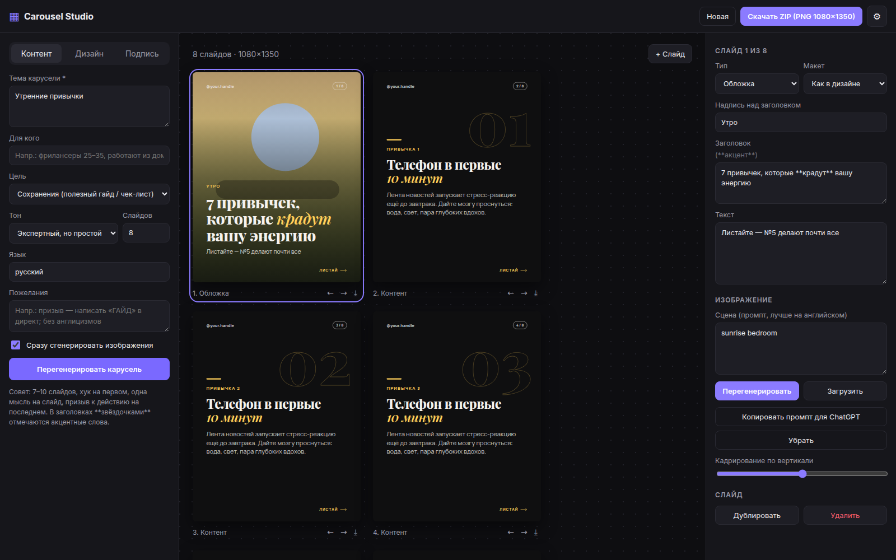

# Carousel Studio — генератор каруселей для Instagram

Веб-приложение, которое делает готовые карусели для Instagram:

1. **Тексты** пишет ChatGPT (OpenAI API) по правилам вирусных каруселей: хук на обложке, одна мысль на слайд, «открытая петля», призыв к действию на последнем слайде, плюс подпись к посту и хэштеги.
2. **Изображения** генерирует GPT Image (`gpt-image-2` по умолчанию) — в едином стиле для всей серии, без текста на картинке и с местом под заголовок.
3. **Красивая типографика** поверх: 10 шрифтов с кириллицей, 8 палитр с контрастом ≥ 4.5:1, акцентные слова (`**так**`), 4 макета, счётчик слайдов, подсказки «листай» / «сохрани», неразрывные пробелы после предлогов.
4. **Экспорт** в PNG 1080×1350 (4:5) — по одному или ZIP со всеми слайдами и `caption.txt`.
5. **8 готовых тем** (Журнал, Дерзкий, Нежный, Чистый, Природа, Постер, Ночь, Тёплый) — шрифты, палитра, макеты и стиль картинок в один клик.
6. **Форматы каруселей**: список «N ошибок», пошаговый гайд, миф vs правда, было/стало, история, чек-лист.
7. **✨ Варианты хука/заголовка** — 5 альтернатив разными приёмами одной кнопкой.
8. **Автоподгонка текста** — длинный текст уменьшается и никогда не вылезает за безопасную зону.
9. **Просмотр как в Instagram** — свайп, точки, подпись с «ещё» после 125 символов и безопасные зоны (обрезка сетки профиля 3:4).



## Сайт

Приложение полностью статическое и автоматически публикуется на **GitHub Pages** при каждом пуше
(workflow `.github/workflows/deploy.yml`): `https://kreal-exe.github.io/carousel-insta/`.

При первом открытии нажмите ⚙ и вставьте свой [API-ключ OpenAI](https://platform.openai.com/api-keys).
Ключ хранится только в вашем браузере (localStorage) и отправляется напрямую в `api.openai.com` — никакого
промежуточного сервера нет. Не открывайте приложение со своим ключом на чужих компьютерах.

> Для моделей GPT Image OpenAI может требовать [верификацию организации](https://platform.openai.com/settings/organization/general). Без неё генерация картинок вернёт 403.

### Включение GitHub Pages (один раз)

1. **Settings → Pages → Build and deployment → Source: GitHub Actions.**
2. Pages для приватного репозитория доступен только на GitHub Pro/Team — иначе сделайте репозиторий публичным
   (**Settings → General → Danger Zone → Change visibility**). Ключей в коде нет, это безопасно.
3. **Actions → Deploy to GitHub Pages → Run workflow** (или любой пуш).

### Локально

```bash
npm install
npm run dev        # http://localhost:3000
npm run build      # статический сайт в out/
```

### Настройки (⚙)

| Параметр | По умолчанию | Примечание |
|---|---|---|
| Модель текста | `gpt-5.5` | любая chat-модель с поддержкой JSON Schema |
| Модель изображений | `gpt-image-2` | для `gpt-image-2` кадр 1088×1360 (ровно 4:5), для `gpt-image-1/1.5` — 1024×1536 с кадрированием |
| Качество | `medium` | `low` — быстрые дешёвые черновики |

Нет доступа к API? Кнопка **«Копировать промпт для ChatGPT»** даёт готовый промпт — сгенерируйте картинку в ChatGPT и загрузите её кнопкой **«Загрузить»**.

## Как пользоваться

1. Вкладка **Контент**: тема, аудитория, цель (сохранения / репосты / комментарии / продажи), тон, число слайдов → «Сгенерировать карусель».
2. Вкладка **Дизайн**: палитра, шрифты, стиль выделения, макеты для обложки / контента / финала, стиль изображений.
3. Кликните слайд, чтобы поправить текст, промпт картинки, перегенерировать или загрузить своё изображение, сдвинуть кадрирование.
4. Вкладка **Подпись**: подпись к посту и хэштеги.
5. «Скачать ZIP».

Проект сохраняется автоматически в браузере (IndexedDB).

## Best practices, заложенные в приложение

- **Формат 4:5, 1080×1350** — занимает больше места в ленте; формат первого слайда задаёт формат всей карусели.
- **7–10 слайдов** для обучающего контента: меньше 5 выглядит как «короткий пост», больше 10 — усталость от свайпов.
- **Обложка = хук**: одна мысль, смелое утверждение / контринтуитивный тезис / обещание результата, до ~8 слов.
- **Одна мысль на слайд** («флеш-карточка, а не абзац блога»), крупный шрифт, много воздуха.
- **Открытая петля**: интрига с первого слайда раскрывается ближе к концу.
- **Контраст ≥ 4.5:1**, 1–2 гарнитуры (заголовки + текст), единый визуальный ритм с меняющимся акцентом.
- **Безопасные зоны**: важное не прижимается к краям и нижней части кадра.
- **Последний слайд — конкретный CTA**: сохранить, отправить другу, написать слово в комментарии/директ.
- **Подпись**: крючок в первых ~125 символах (видны до «ещё»).

Источники: [TrueFuture Media](https://www.truefuturemedia.com/articles/instagram-carousel-strategy-2026), [Adpicto](https://www.adpicto.com/en/blog/instagram-carousel-best-practices-2026), [Pineable](https://pineable.com/blog/social-media-carousel-design-best-practices), [AdaptlyPost](https://adaptlypost.com/blog/text-overlays-on-instagram-carousels), [Contentdrips](https://contentdrips.com/blog/2026/05/instagram-carousel-size-format/), [OpenAI Image generation](https://developers.openai.com/api/docs/guides/image-generation).

## Стек

Next.js 16 (static export) · React 19 · TypeScript · OpenAI REST API · `html-to-image` · `jszip`. Шрифты самохостятся через `next/font`, поэтому корректно встраиваются в PNG.

```
lib/openai              — запросы к OpenAI из браузера (тексты + изображения)
components/SlideView    — рендер слайда 1080×1350 (4 макета, автоподгонка текста)
components/InstagramPreview — просмотр как в ленте Instagram
components/App          — редактор
lib/presets             — шрифты, палитры, стили изображений
lib/imagePrompt         — сборка промпта и размер кадра под модель
```
