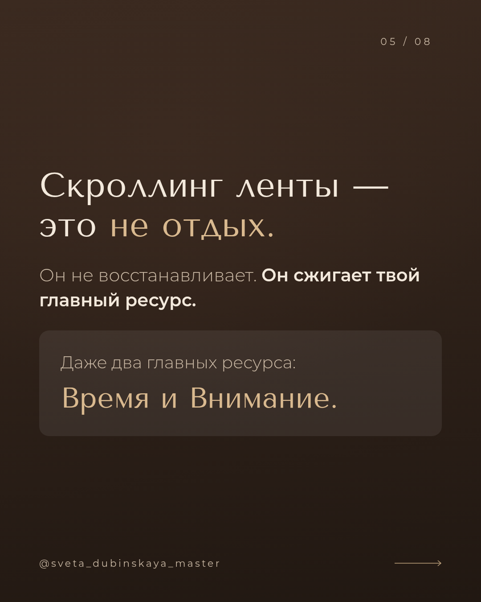

# Carousel Studio — редактор каруселей для Instagram

**Сайт:** https://kreal-exe.github.io/carousel-insta/

Пишете текст — сразу видите готовые слайды 1080×1350 в едином стиле, меняете шрифты и цвета, скачиваете PNG.



## Как работает

**Слева — текст.** Два способа, между ними можно переключаться в любой момент:

- **По слайдам** — у каждого слайда своё поле. Кнопки над полем: **Акцент**, **Заголовок**, **Линия**, **Плашка**, **Цитата**.
- **Одним текстом** — вставьте весь текст целиком. Слайды разделяются строкой `===`, либо кнопками:
  «Каждый абзац — отдельный слайд» или «Разбить поровну на N слайдов».

**В центре — живое превью** выбранного слайда и лента всех слайдов. Фото можно перетащить прямо на слайд.

**Справа — стиль:** темы (Крем и шоколад, Графит, Олива, Пудра, Океан, Чёрно-белый), шрифты заголовков / текста /
обложки, размеры, выравнивание, ник, номер «02 / 11», стрелка, чередование светлых и тёмных слайдов, свои цвета.

## Разметка текста

| Что написать | Что получится |
|---|---|
| первый абзац слайда | крупный заголовок (элегантным шрифтом) |
| следующие абзацы | обычный текст |
| `**слова**` | акцент: в заголовке — цветом, в тексте — жирным |
| `# строка` | крупная строка в любом месте слайда |
| `---` | тонкая линия-разделитель |
| `> строка` | цитата с вертикальной линией |
| `! строка`, `! # строка` | плашка: мелкий и крупный текст на ней |

Слайд с фото оформляется как обложка: фото на весь кадр с дымкой, заголовок капсом, подпись справа.

## ChatGPT (по желанию)

- **✨ Написать текст с ChatGPT** — откроет chatgpt.com с готовым заданием по правилам вирусных каруселей
  (хук, одна мысль на слайд, призыв в конце). Скопируйте ответ → «Вставить ответ» — он разложится по слайдам.
- **фото в ChatGPT** у каждого слайда — задание на фото без текста в выбранном стиле; скачанное фото перетащите на слайд.
- ⚙ — необязательный API-ключ OpenAI: тогда текст и фото генерируются прямо в приложении (ключ хранится только в браузере).

Всё сохраняется в браузере автоматически.

## Разработка

```bash
npm install
npm run dev     # http://localhost:3000
npm run build   # статический сайт в out/
```

Деплой на GitHub Pages — автоматически при пуше (`.github/workflows/deploy.yml`).
Стек: Next.js 16 (static export), React 19, TypeScript, html-to-image, JSZip; шрифты с кириллицей через next/font.
